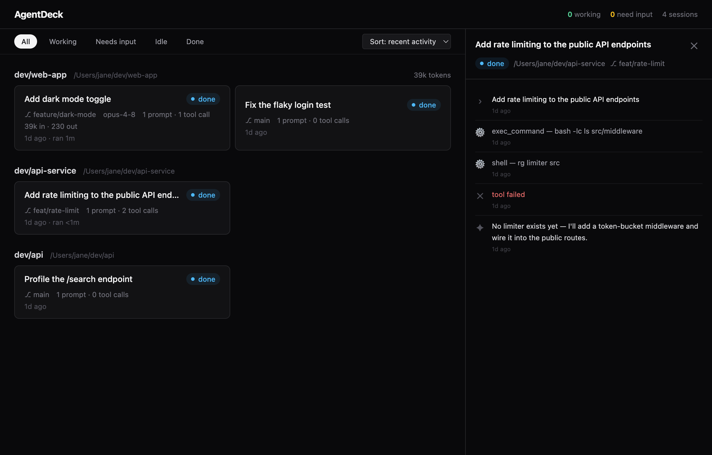

# AgentDeck

**Mission control for your coding agents.** Monitor every Claude Code and Codex CLI session on your machine from one window — see who's working, who's blocked waiting for your input, and who's done.



## Why

The way we build software changed: one developer now supervises several coding agents running in parallel — Claude Code in two git worktrees, Codex CLI on a refactor, another session reviewing a PR. What didn't change is the tooling: that fleet lives in a pile of terminal tabs, and the human has become a scheduler with no scheduler UI.

You don't know which agent is blocked on an approval prompt, which finished twenty minutes ago, and which is quietly burning tokens down a rabbit hole. AgentDeck makes the fleet visible.

## What it does

- **Discovers sessions automatically** by reading the transcripts agents already write to disk (`~/.claude/projects`, `~/.codex/sessions`) — no wrappers, no shims, your workflow doesn't change.
- **Live status board**: sessions grouped by project with derived status — `working`, `needs input`, `idle`, `done` — plus filtering and sorting.
- **Native notifications** the moment an agent needs you; click to jump straight to that session.
- **System tray** with aggregate status and a quick-list of recent sessions.
- **Session detail**: a timeline of prompts, replies, and tool calls (failures highlighted).
- **Workspace context**: git diff summaries per project worktree and token usage per session and project.

## Install

Pre-built downloads (macOS/Windows/Linux) will appear on the [releases page](https://github.com/adonayeshetu/agentdeck/releases) once the first version is tagged. Until then, build from source:

```bash
git clone https://github.com/adonayeshetu/agentdeck && cd agentdeck
npm install
npm run dist        # installers in dist/, or `npm run dev` to just run it
```

## Architecture

```
┌────────────────────── Main process (privileged) ──────────────────────┐
│  agents/         AgentAdapter interface + per-agent implementations   │
│  sessions/       SessionStore: events → SessionState (status machine) │
│  watchers/       chokidar + byte-offset JSONL tailing                 │
│  git/            worktree diff stats (spawned git)                    │
│  notifications/  status transitions → native notifications            │
│  tray/           aggregate status + quick-list                        │
│  ipc/            typed IPC router (snapshot + delta protocol)         │
└──────────────┬────────────────────────────────────────────────────────┘
               │  contextBridge: minimal typed `window.api`
┌──────────────┴────────── Renderer (sandboxed, zero Node) ─────────────┐
│  React + Zustand · board view · session timeline                      │
└────────────────────────────────────────────────────────────────────────┘
```

Design rules that keep this codebase contributable:

1. **The agent adapter layer is pure TypeScript** — no Electron imports, tested against fixture directories. Supporting a new agent means implementing one interface; the Codex adapter (~150 lines + fixtures) is the reference. See [docs/ARCHITECTURE.md](docs/ARCHITECTURE.md) and the [ADRs](docs/adr/).
2. **Strict Electron security posture**: sandboxed renderer, context isolation, no node integration, locked-down navigation and permissions, CSP — all enforced by unit and e2e tests.
3. **Main process is the single source of truth**; the renderer hydrates from a snapshot and applies deltas. Status is a pure function of transcript timestamps, so every behavior is deterministic and testable.

## Development

```bash
npm install
npm run dev        # launch with HMR
npm test           # unit tests (Vitest)
npm run test:e2e   # Playwright against the built app
npm run lint       # ESLint (type-aware)
npm run typecheck  # tsc, node + web + e2e projects
npm run dist       # package installers
```

Requires Node 22+.

## Contributing

See [CONTRIBUTING.md](CONTRIBUTING.md) and the [good first issues](docs/good-first-issues.md). The [roadmap](docs/ROADMAP.md) is broken into commit-sized, individually testable tasks.

## License

[MIT](LICENSE)
